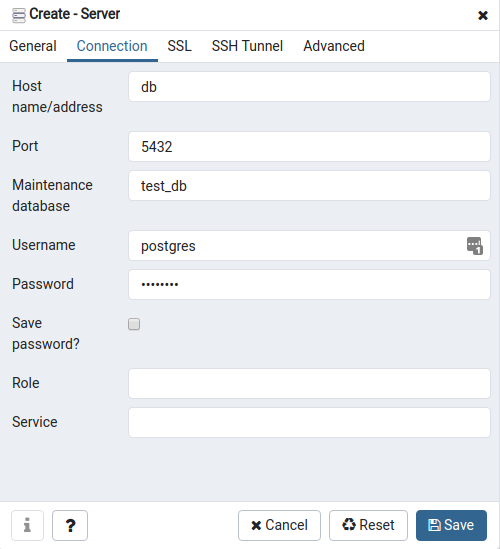
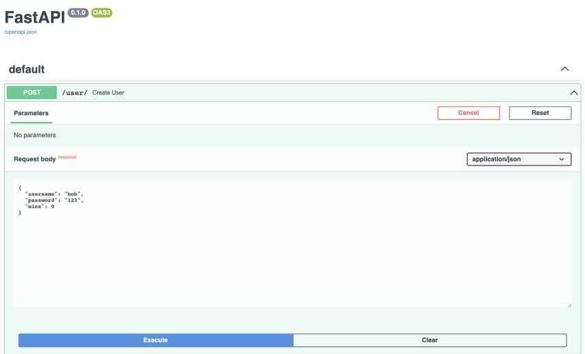
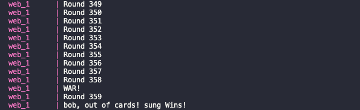

# War Card Game

Welcome to the war card game. This project was built using FastAPI, PostgreSQL, Alembic, and Docker.

## Getting Started

// teach them open
// screen shot of server getting created
// screen shot of terminal
// provide more info end point

### How to build

`docker-compose build`

### Run Migrations

```
alembic revision --autogenerate -m "first commit"
alembic upgrade head
```

### How to run db

- run `docker-compose up`
- go to `localhost:5050`
- and login with `user=pgadmin4@pgadmin.org` and `password=admin`

  

- In general, choose a name for the connection i.e war
- Connect to the database server, password is `postgres` as well

  

### Project Walkthrough

Now lets go to `localhost:8000/docs/` and invoke the `Create User` endpoint two times to create two players.



### end points

1. `post /user/` will create a user in the db
2. `get /users/` will return all users in the db along with their total wins
3. `get /war/` will grab two random users in the db and play the game of war. This endpoint will also:
   - update the players wins column in the db
   - return the winner, along with the opponent and how many rounds it took to win the match
   - the terminal will show a more details on the match with the winner at the end



## What I Would Add/Change

1. Tests

   - Given more time,

2. Include UI

   - Error handling itself was challenging learning and using a new framework/language.

3. Use a framework I am more comfortable with
   - A lot of time
