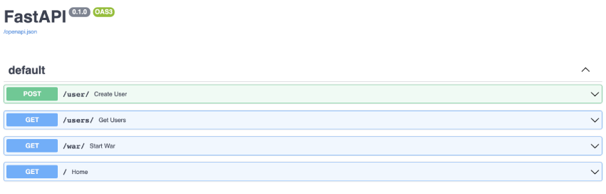

# War Card Game

Welcome to the war card game. This project was built using FastAPI, PostgreSQL, Alembic, and Docker.

## Getting Started

---

Clone this repository and `cd server`

### How to build

- `docker-compose build`

<!-- ### Run Migrations

```
alembic revision --autogenerate -m "first commit"
alembic upgrade head
``` -->

### How to run db

- run `docker-compose up` (there may be a little wait time for it to load)
- go to `localhost:5050`
- and login with `user=pgadmin4@pgadmin.org` and `password=admin`

  

- In general, choose a name for the connection i.e war
- Connect to the database server, password is `postgres` as well

  

## Project Walkthrough

---

FastAPI provides an interactive API docs page. Lets go to `localhost:8000/docs/`.



Lets invoke the `Create User` endpoint two times to create two players.


### Endpoints

---

1. `POST /user/` will create a user in the db
2. `GET /users/` will return all users in the db along with their total wins
3. `GET /war/` will grab two random users in the db and play the game of war. This endpoint will also:
   - update the players wins column in the db after it determines a winner
   - return the winner, along with the opponent and how many rounds it took to win the match
   - the terminal will show more details on the match with the winner at the end


### Testing

---

- `cd server`
- `pipenv install`
- `pipenv shell`
- `pytest`

## What I Would Add/Change

1. Include UI

   - Error handling itself was challenging learning and using a new framework/language.

2. Use a familiar framework
   - I took a risk of learning utilizing Python and FastAPI for my language/framework. It took a lot of time reading documentation
