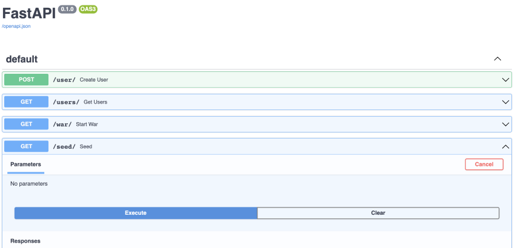

# War Card Game

Welcome to the war card game. This project was built using FastAPI, PostgreSQL, Alembic, and Docker.

## Getting Started

Clone this repository and run the following commands:

### How to build

- `docker-compose build`

### How to run db

- run `docker-compose up` (there may be a little wait time for it to load)
- go to `localhost:5050`
- and login with `user=pgadmin4@pgadmin.org` and `password=admin`

  

- In general, choose a name for the connection i.e war
- Connect to the database server, password is `postgres` as well

  

## Project Walkthrough

FastAPI provides an interactive API docs page. Lets go to `localhost:8000/docs/`.

Lets invoke the `Seed` endpoint to create users in the database.

### Endpoints

1. `POST /user/` will create a user in the db
2. `GET /users/` will return all users in the db along with their total wins
3. `GET /war/` will grab two random users in the db and play the game of war. This endpoint will also:
   - update the players wins column in the db after it determines a winner
   - return the winner, along with the opponent and how many rounds it took to win the match
   - the terminal will show more details on the match with the winner at the end

### Testing

In the terminal, run the following commands:

- `docker-compose up`
- `docker exec -it server_web_1 bash`
- `pytest`

1. Check the welcome message when you first hit the `GET /` route.
2. Check to see if the database count of all users will increment by 1 when you hit the `POST /user/` route.

## What I Would Add/Change

1. Include UI

   - If I had to start over, I would put the game logic on the frontend and create a better user experience. Right now, it is not a satisfying user experience to play the game.

2. Use a familiar framework

   - The setup was easy for FastAPI but the initial learning curve was steep to implement Docker and get it connected to a PostgreSQL db.
   - Using a familiar framework would've given me more time to focus on user experience.

3. Testing
   - Due to the time constraint, I did not implement a setup and teardown situation for my add user test.
   - Incorporating more tests.

## What I Learned

I took a risk of learning Python and FastAPI for my language/framework. It took a lot of time reading documentation and learning different nuances from JavaScript/Node.js. It was also my first time taking a deep dive into Docker as well.

I did trade off user experience but I am extremely happy to have learned all these new technologies and showcase my skill to learn something new and to be able to implement it.
